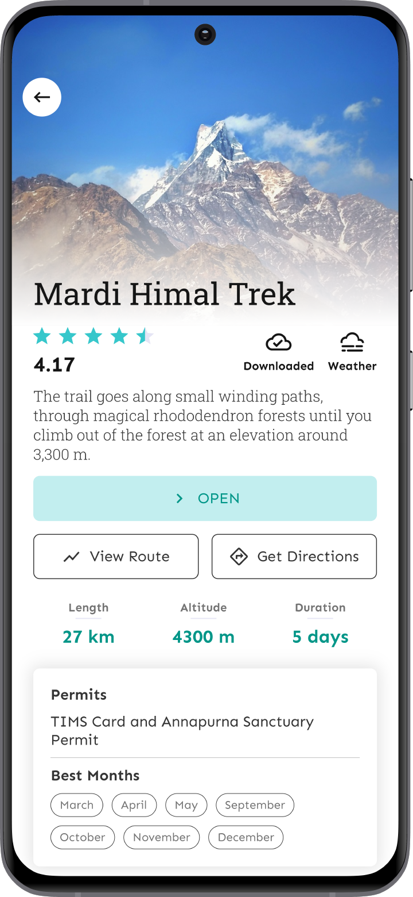
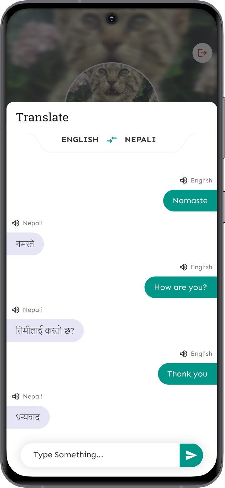
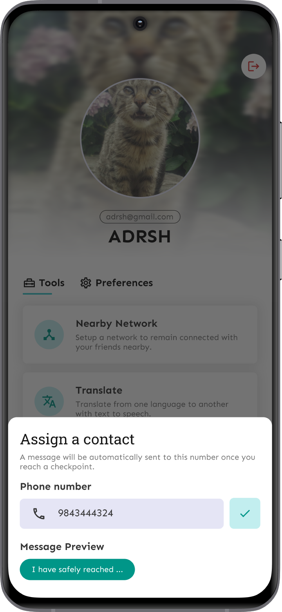
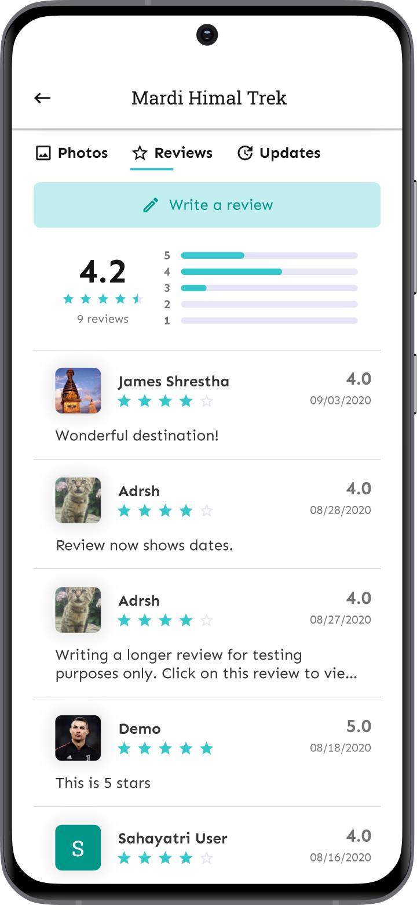
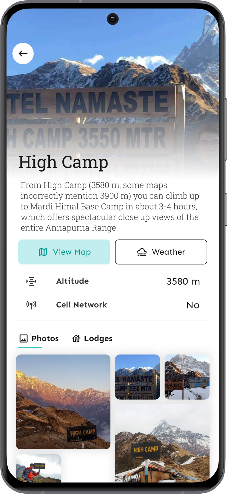
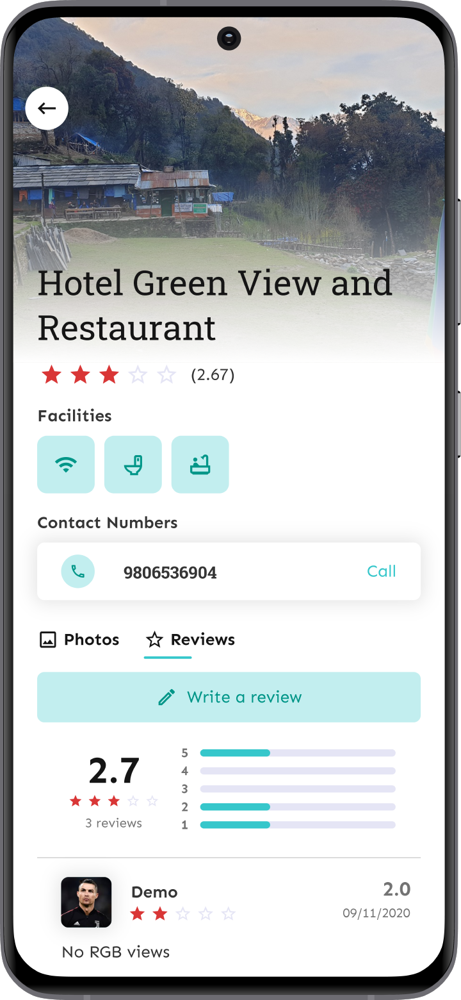
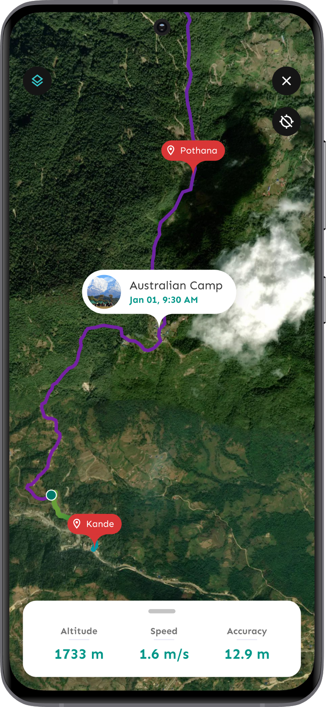

# Sahayatri

A virtual travel companion.

## Features

- View and search popular touristic destinations.
- Download any destination for offline usage.
- Get required information such as permits, best months, duration, photos etc. of a destination.
- View a 7-day weather forecast of different places on a destination.
- Get driving, walking and cycling directions to a destination using Google Maps.
- View an interactive map with route, places and points of interest.
- Write and read reviews to select the best destination for your next trip.
- Read and post updates to let others know about potential dangers, interests and alerts along a route.
- Get a list of lodges in a place along with the reviews, facilities, photos and contact information.
- View a list of suggested itineraries for ease of travel.
- Create your own itineary by adding checkpoints with dates and places along a route.
- Track your location along a route and get alerted if you go off-route.
- View connected nearby devices and their statistics on the map.
- Automatically send a sms to a close contact once you reach a checkpoint.
- View your location details such as altitude, accuracy, speed etc.
- Get helpful information like remaining distance and ETA about the next checkpoint on the route.
- Use Nearby Network to stay connected to your travel group and get notified when someone is disconnected.
- Send SOS message to nearby devices in case of emergency.
- Translate text in a chat-like interface between 60+ different languages with Text to Speech support.
- Assign a close contact to notify them about the whereabouts of your journey.
- Switch between dark, light and system themes.

## Built With

- [Flutter](https://flutter.dev)

## Demo

- [Watch the demo on YouTube](https://www.youtube.com/watch?v=Ql9Dx3MmaBk)

## Screenshots

                    